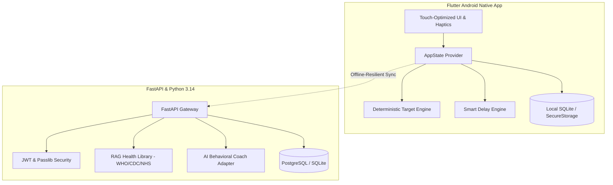

<p align="center">
  
</p>

<h1 align="center">Clarity — Smoking Coach</h1>

<p align="center">
  <strong>A quiet, private behavioral companion engineered on cognitive-behavioral cue extinction and deterministic health economics.</strong>
</p>

<p align="center">
  <a href="https://flutter.dev"></a>
  <a href="https://dart.dev"></a>
  <a href="https://developer.android.com"></a>
  <a href="https://fastapi.tiangolo.com"></a>
  <a href="https://python.org"></a>
  <a href="#license"></a>
</p>

<p align="center">
  <em>"Don't just count cigarettes. Understand why you smoke them."</em>
</p>

---

## 👨‍💼 Leadership & Credits

> **Product Designed and Managed by [Mohammed Shazaan Aarish](https://github.com/SHAZAAN25)**  
> *Architected from the ground up to replace punitive cessation tropes with empathetic behavioral self-regulation, deterministic math, and native mobile-first touch ergonomics.*

---

## 🌿 Core Product Philosophy

Most smoking apps fail because they treat tobacco dependence like a binary moral test. The moment a user slips, they trigger punitive alerts: *"Streak Broken!"*, *"You Failed"*, or aggressive red countdowns.

**Clarity takes the opposite approach:**

1. **Relapse is Information, Not Failure**: If you exceed your target, Clarity doesn't punish you. It captures context—stress cues, social triggers, alcohol pairing—to refine your personal behavioral model.
2. **Deterministic Target Engine**: Reduction targets are governed by strict mathematical evaluation cycles (7-day evaluation windows, 10% reductions, minimum floor of 1 cigarette/day, stabilization pauses upon consecutive stalls).
3. **Interrupted Habit Loop Motif**: Replaced aggressive crosshair/scope imagery with an organic double-arc symbol that gently breaks open into unbounded space—symbolizing mindfulness and release from automatic cravings.
4. **Local-First Privacy Architecture**: All cigarette logs, timestamps, cravings, and behavioral patterns are stored encrypted locally on device. No sensitive health telemetry is sold or tracked.
5. **Exact INR Economics**: Pure ₹ INR cost calculations down to the single cigarette (`packPrice / cigarettesPerPack = costPerCigarette`).

---

## 📱 Native Mobile Application Highlights

Built with Flutter 3.x for native Android execution:

- ⏱️ **2-Second Quick Log**: Instant 1-tap logging with optional situational tags (`Stress`, `Coffee`, `Work`, `Social`, `Commute`).
- 🌊 **Craving Intervention Engine**:
  - Dynamic adaptive delay timer calculating optimal resistance windows.
  - Interactive **4-7-8 Breathing Orb** visualizer with smooth sinusoidal pacing.
  - Quick-switch interventions: **Delay**, **Breathe**, **Water**, and **Walk** with zero RenderFlex overflow on any mobile screen aspect ratio.
  - Non-punitive check-in: *"Craving passed"* vs *"Smoked anyway"*.
- 🕒 **24-Hour Chronological Smoking Clock**: Renders your unique diurnal rhythm of cigarettes, cravings, and conscious delays across morning, afternoon, and evening.
- 📳 **Subtle Tactile Haptics**: Native vibration feedback across tab navigation (`selectionClick`), action triggers (`lightImpact`), and log confirmations (`mediumImpact`).
- 🖼️ **Edge-to-Edge Experience**: Fully transparent Android navigation and status bars dynamically styled for dark and light theme palettes.

---

## 🏛️ System Architecture



---

## ⚙️ Deterministic Target Engine Rules

| Mode | Trigger Condition | Target Behavior |
| :--- | :--- | :--- |
| **REDUCE** | Default active mode | Evaluates weekly. If weekly average $\le$ target and $\ge 5$ valid tracking days, target decreases by $10\%$ (rounded to integer, floor of 1). |
| **STABILIZE** | 2 consecutive failed cycles | Pauses reduction. Locks target at current level to prevent burnout and regain habit stability. |
| **QUIT BY DATE** | Fixed date selected | Calculates deterministic daily decrement reaching exactly 0 on target date. |
| **QUIT NOW** | Immediate cessation | Target held strictly at 0. Tracks smoke-free hours and consecutive craving resistance. |

---

## 📂 Repository Structure

```
Clarity/
├── mobile/                  # Flutter Android Native Application
│   ├── lib/
│   │   ├── models/          # UserProfile, CigaretteLog, CravingLog, TargetHistory
│   │   ├── providers/       # AppState central reactive store
│   │   ├── screens/         # Home, CravingControl, Progress, Coach, Settings
│   │   ├── services/        # TargetEngine, SmartDelayEngine, StorageService
│   │   ├── theme/           # Obsidian Sage Design System, Typography, Colors
│   │   └── widgets/         # ClarityBrandLogo, SmokingClock, GoalCard, Buttons
│   └── android/             # Android native platform config & adaptive mipmaps
├── backend/                 # FastAPI REST API & AI Service
│   ├── app/
│   │   ├── api/             # Auth, Tracking, Analytics, Coach, Evidence endpoints
│   │   ├── core/            # Config, Security, JWT
│   │   ├── models/          # SQLAlchemy Database Models
│   │   └── services/        # RAG Search Engine, LLM Safe Coach Adapter
│   └── requirements.txt
├── frontend/                # React 19 / TypeScript Web Companion Dashboard
│   ├── src/
│   └── package.json
└── README.md
```

---

## 🚀 Quickstart & Setup

### Prerequisites
- Flutter SDK 3.29+ / 3.47+
- Android Studio / Android SDK (API 34+)
- Python 3.11+ / 3.14+
- Node.js 18+

### 1. Flutter Mobile App (Android)
```bash
cd mobile
flutter pub get
flutter run
```
To generate release APK and sideload to your physical device via ADB:
```bash
flutter build apk --release
adb install -r -d build/app/outputs/flutter-apk/app-release.apk
```

### 2. Backend Service
```bash
cd backend
python -m venv venv
# Windows:
.\venv\Scripts\activate
# Unix:
source venv/bin/activate

pip install -r requirements.txt
uvicorn app.main:app --host 0.0.0.0 --port 8000 --reload
```
Interactive OpenAPI documentation will be accessible at: `http://localhost:8000/docs`

### 3. Frontend Web Dashboard
```bash
cd frontend
npm install
npm run dev
```

---

## 🧪 Testing & Verification

Comprehensive test suites are included across mobile, target calculation math, and backend API:

```bash
# Mobile Engine & Acceptance Tests (18 passing tests)
cd mobile
flutter test

# Codebase static analysis (0 errors, 0 warnings)
flutter analyze

# Backend API & Safety Tests
cd backend
pytest app/tests
```

---

## 📄 Medical & Regulatory Disclaimer

Clarity is an evidence-informed behavioral reduction and self-monitoring tool based on principles of Cognitive Behavioral Therapy (CBT). It does not provide medical diagnosis, clinical pharmacology, prescription guidance, or psychiatric emergency care. If you experience acute withdrawal symptoms or medical emergencies, consult a certified physician immediately.

---

## 📜 License

Distributed under the MIT License. See `LICENSE` for details.

---

<p align="center">
  <b>Clarity — Smoking Coach</b><br>
  Designed & Managed with care by <b>Mohammed Shazaan Aarish</b>
</p>
